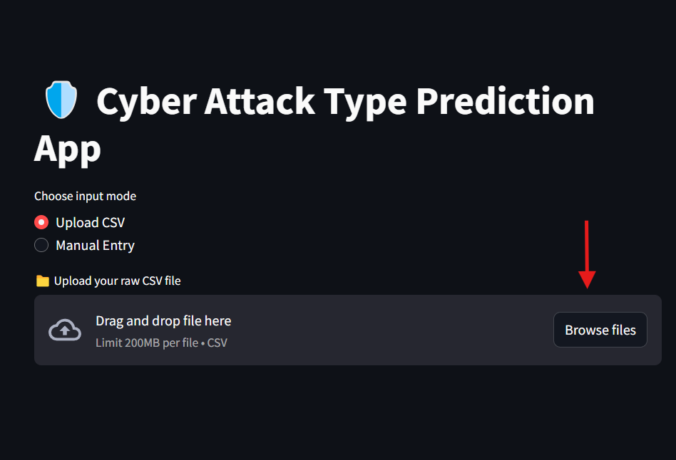
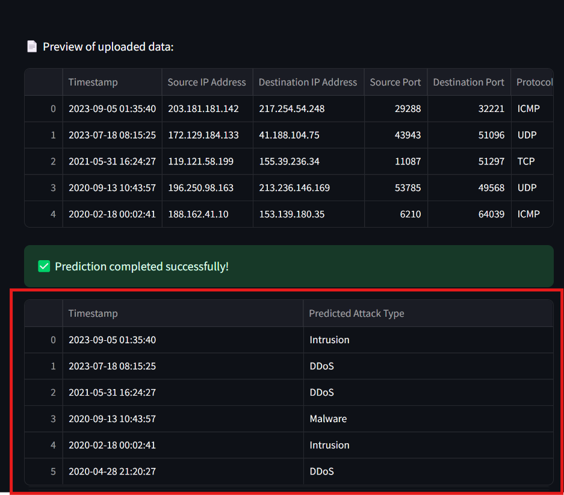

# Cybersecurity Attack Predictor


This web application analyzes user-provided details of a cyber attack and predicts the likely attack type. It identifies one of three possible categories: **DDoS (Distributed Denial of Service), Intrusion, or Malware**. It uses a Random Forest Classifier—a machine learning model—to make predictions.


## Installation

Software requirements:

[Anaconda Navigator](https://www.anaconda.com/download)

**Instructions:**

- Install Anaconda Navigator.
- Clone the Repository.
    ```bash
    git clone https://github.com/raaja-snd/Cyber-attack-Prediction.git
    ```
- Create a new environment using Anaconda Prompt. Ex.
    ```bash
    conda create -n example_env
    ```
- Activate the new environment.
    ```bash
    conda activate example_env
    ```
- From Anaconda Prompt navigate to the path with **requirements.txt** file in your cloned repository.
- Install the packages required by the Web application using the following command.
    ```bash
    conda install --file requirements.txt
    ```
- Navigate to **app/** from Anaconda Prompt and Run the web application using the following command
    ```bash
    streamlit run webapp.py
    ```
    Running this command will automatically launch the web applicaiton in a browser.
    
## Usage/Examples

The web application accepts inputs with the following 24 attributes as either a CSV file or manual inputs.

    - Timestamp
    - Source IP Address
    - Destination IP Address
    - Source Port
    - Destination Port
    - Protocol
    - Packet Length
    - Packet Type
    - Traffic Type
    - Payload Data
    - Malware Indicators
    - Anomaly Scores
    - Alerts/Warnings
    - Attack Signature
    - Action Taken
    - Severity Level
    - User Information
    - Device Information
    - Network Segment
    - Geo-location Data
    - Proxy Information
    - Firewall Logs
    - IDS/IPS Alerts
    - Log Source

**Example:**  
This is an example where a csv file containing 5 inputs are uploaded to the web app for prediciton.

- Click on Browse and select your file.

    

- Below are the results from the app.

    
## Authors

- [Fatima-Zahra Aboudafir](https://github.com/Fatima-ZahraAB)
- [Nihal Dakkoune](https://github.com/Nihal-DAKKOUNE)
- [Raaja Selvanaathan Datchanamourthy](https://github.com/raaja-snd)


